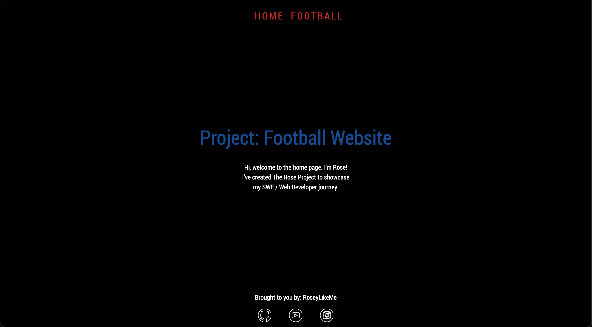
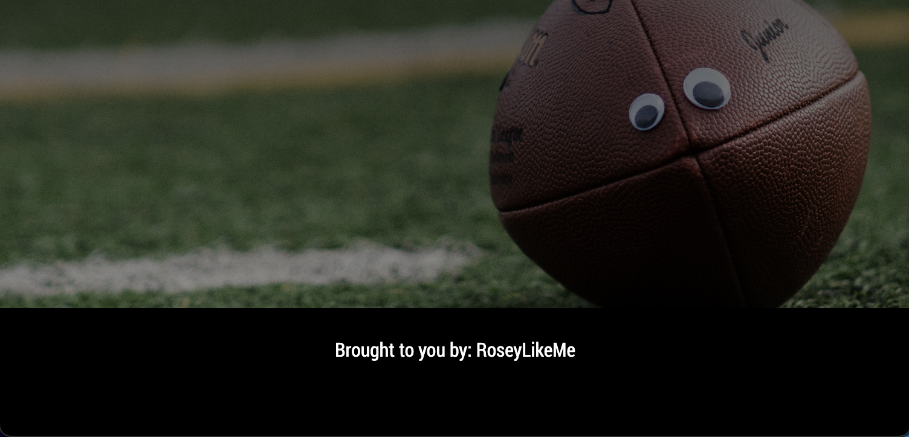

# Football Teams Project

Simple webpage about football teams that allow users to pick a team from a dropdown menu loaded from javascript, and see where they play from.

Check it out: https://roseylikeme.github.io/football-project/

    
    

## Challenges Faced
Something that was bothering me and took a bit of my time when completing this project was getting the background image to cover the entire webpage. 

I was able to workaround this by assigning my html & body elements the same class.

## What I Learned
In this project, I learned how to load the <select> from an array when the window loads in javascript. I've also learned how to programmatically remove an item from a select list through the remove() method.

Something i've learned through doing this project that I didn't know prior to this is how to change the background image of the html page when a button is clicked. I accomplish this by simply creating different classes per team & changed the bg image respectively.